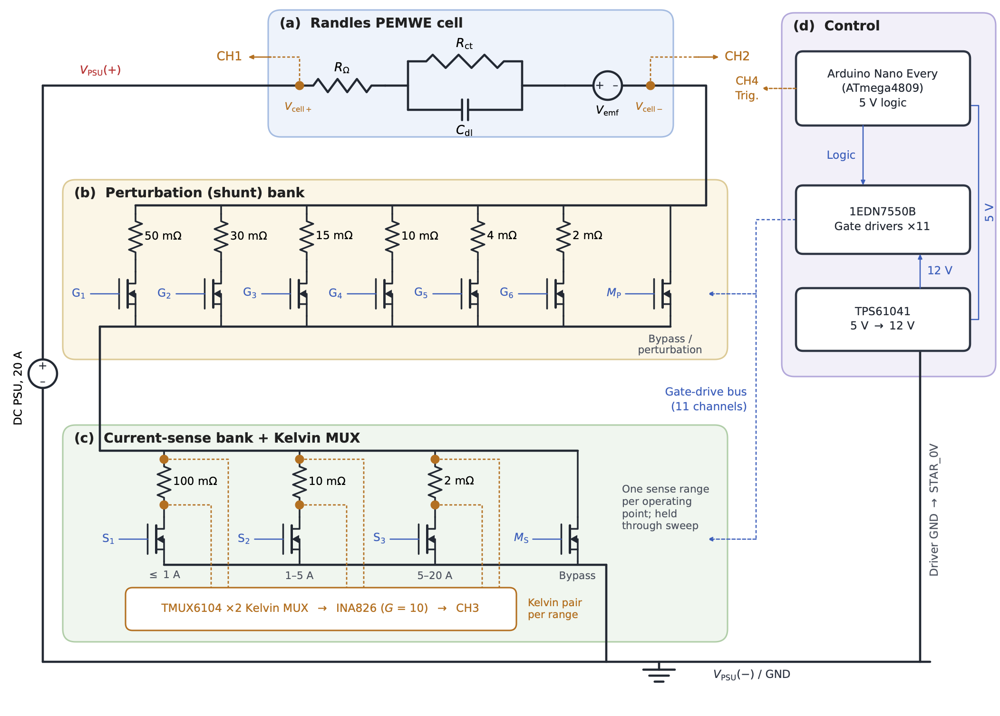

# Switched-Current Impedance Spectroscopy for PEM Water Electrolysis

**SCIS** is a MATLAB/Simulink simulation workflow for recovering electrochemical impedance from current perturbations produced by a switched resistor bank. A configurable perturbation bank and ranged current-sensing bank are evaluated using a simplified proton exchange membrane water electrolyser (PEMWE) equivalent circuit.

**Repository release: v1.0 | Model: V3 | Scheduler: V3 | Post-processing: V7**

[Setup and dependencies](DEPENDENCIES.md) · [Release notes and results](RELEASE-NOTES.md) · [Citation](CITATION.cff) · [Attribution and AI use](ATTRIBUTION.md) · [MIT licence](LICENSE)


## Scope

- Five operating current densities: **0.05, 0.10, 0.50, 1.00 and 4.00 A/cm²**, corresponding to **0.25–20 A** for a 5 cm² cell.
- **47 logarithmically spaced frequencies per operating point**, descending from **10 kHz to 1 Hz**.
- Resistance switching at 50% duty cycle, with settling before eight acquired cycles at each frequency.
- Fundamental voltage/current extraction using time-weighted Fourier integration on native solver timestamps.
- Nyquist and current-waveform figures, per-frequency results, error summaries and a compact result cache.

The reference run used a maximum solver step of **3.125 µs**. Across 235 records, mean and maximum complex impedance errors relative to the configured model were **0.01078%** and **0.02367%**. All records passed the numerical checks; two exceeded the separate excitation-amplitude criterion. [Release notes](RELEASE-NOTES.md) give the scope and exceptions.

These results assess reconstruction within a prescribed linear model. They do not establish experimental accuracy, electrochemical linearity or solver convergence. Shared current-interrupt (CI) functionality is proposed; hardware and CI operation are not validated by this release.

## Files

| File | Purpose |
| --- | --- |
| [SCIS_V3.slx](SCIS_V3.slx) | Simulink circuit model |
| [Sweep_Scheduler_V3.m](Sweep_Scheduler_V3.m) | Source for the embedded MATLAB Function sweep scheduler |
| [SCIS_Post_Processing_V7.m](SCIS_Post_Processing_V7.m) | Impedance extraction, figures, tables and compact caching |
| [System overview](figures/proposed-system.png) | Proposed measurement arrangement |
| [Circuit diagram](figures/SCIS_Diagram_.png) | Proposed switching, sensing and control architecture |

## Getting started

Use MATLAB/Simulink **R2025b** and the model's required block libraries. Follow [DEPENDENCIES.md](DEPENDENCIES.md) to check the scheduler, solver settings and logged signals.

```matlab
info = SCIS_Post_Processing_V7;
```

Run `SCIS_V3` from time zero to `info.stopTime` (approximately **318.104085 s**) with a maximum step of `3.125e-6` s. With the simulation output in `out`:

```matlab
result = SCIS_Post_Processing_V7(out,struct( ...
    'outputDir','SCIS_V7_publication', ...
    'runMaxStep',3.125e-6));
```

`runMaxStep` records the setting used; it does not configure the solver. The output folder contains PDF/PNG/FIG plots, `SCIS_metrics.xlsx`, CSV tables and `SCIS_results.mat`. Failure flags remain in the tables. The MAT file contains extracted results and display data, not the complete raw logs.

## Proposed circuit



The circuit illustrates the proposed instrument. This release supplies simulation software, not a fabrication-ready hardware package.

## Reuse and citation

Original project software, simulation models, documentation and original figure contributions are released under the [MIT licence](LICENSE). Preserve the copyright and licence notice when redistributing. Third-party software and source publications retain their own terms; see [ATTRIBUTION.md](ATTRIBUTION.md).

For research use, please cite this release using [CITATION.cff](CITATION.cff).
